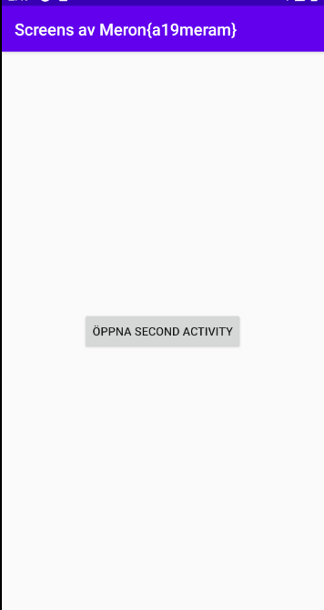
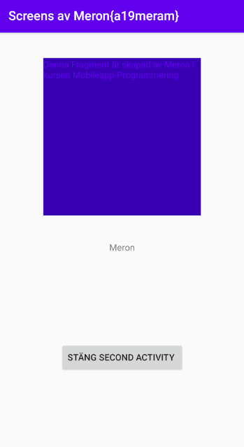

# Rapport

**Skriv din rapport här!**

Den andra duggan gick ut på att man skulle lägga till en andra Activity för att sedan kunna navigera mellan den första sida till andra,
detta gör man med hjälp av knappar som finns på båda sidorna där knapparna är länkad till att utföra skiftningen mellan sidorna.
Sista kravet går ut på att man lägger till en fragment i den andra Activity som vi har skapat i första steget. Koden nedan visar skapandet av knappen som navigerar mellan,
där knappen kommer att placeras i mitten av skärmen med hjälp av layout_constraint.
I figur 1 kan vi se hur knappen för den första Activity är placerad där layout_constraint är använt för att placera den. I figur 2 kan vi se resultatet av koden som visas ner
där den berör hur en fragment struktureras i en xml-fil och dess design för att sedan kunna få den illustrerande figuren som ett resultat

```
     <Button
            android:id="@+id/My_button"
            android:layout_width="wrap_content"
            android:layout_height="wrap_content"
            android:text="Öppna Second Activity"
            tools:ignore="MissingConstraints"
            app:layout_constraintBottom_toBottomOf="parent"
            app:layout_constraintLeft_toLeftOf="parent"
            app:layout_constraintRight_toRightOf="parent"
            app:layout_constraintTop_toTopOf="parent"
             />
     <fragment
             android:name="com.example.screens.BlankFragment"
             android:layout_width="250dp"
             android:layout_height="250dp"
             android:tag="blank_fragment"
             app:layout_constraintBottom_toTopOf="@+id/name"
             app:layout_constraintEnd_toEndOf="parent"
             app:layout_constraintStart_toStartOf="parent"
             app:layout_constraintTop_toTopOf="parent" />

```

Bilder läggs i samma mapp som markdown-filen.




Läs gärna:

- Boulos, M.N.K., Warren, J., Gong, J. & Yue, P. (2010) Web GIS in practice VIII: HTML5 and the canvas element for interactive online mapping. International journal of health geographics 9, 14. Shin, Y. &
- Wunsche, B.C. (2013) A smartphone-based golf simulation exercise game for supporting arthritis patients. 2013 28th International Conference of Image and Vision Computing New Zealand (IVCNZ), IEEE, pp. 459–464.
- Wohlin, C., Runeson, P., Höst, M., Ohlsson, M.C., Regnell, B., Wesslén, A. (2012) Experimentation in Software Engineering, Berlin, Heidelberg: Springer Berlin Heidelberg.
